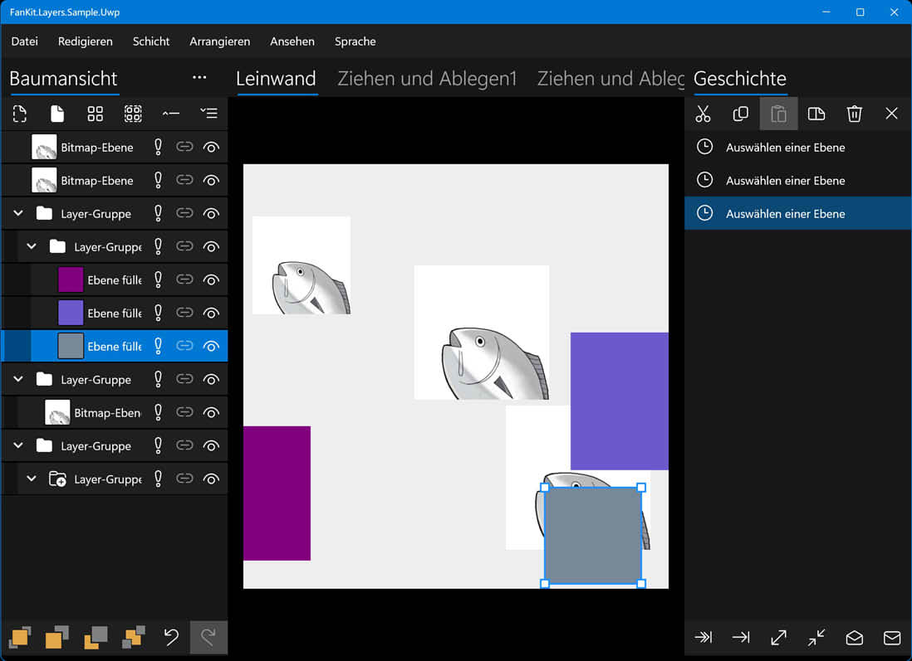

# FanKit.Layers

FanKit.Layers ist eine Erweiterung der XAML-Listenansicht für die Entwicklung mit .NET UWP/WPF/WinUI/Maui.

Enthält Knoten/Layer/Verlauf, die zum Erstellen der Baumansicht/des Layer-Panels/des Verlaufspanels verwendet werden, die auf das Rendern von 2D-Grafiken abzielen.

## Entwicklungsumgebung

|Key|Value|
|:-|:-|
|Systemanforderungen| Windows 10 1803 oder höher|
|Entwicklungswerkzeug|Visual Studio 2022|
|Programmiersprache|C#|
|Sprache anzeigen|Deutsch/English/español/français/italiano/日本語/한국어/русский/中文(简体)|

## Anwendungsbeispiel

|Fachwerk|Fortschritt|
|:-|:-|
|UWP|Abgeschlossen|
|WPF|Im Bau...|
|WinUI3|Im Bau...|
|Maui|Im Bau...|

## Nuget

Im Bau...

## Wie kann ich die Quellcode-Kommentare anzeigen?

1. Ordner **...\FanKit.Layers\doc** suchen
2. Überschreiben der Datei **docs.xml** mit der Datei **de\docs.xml**
3. Bewegen Sie den Mauszeiger über den Code, und eine QuickInfo wird angezeigt
