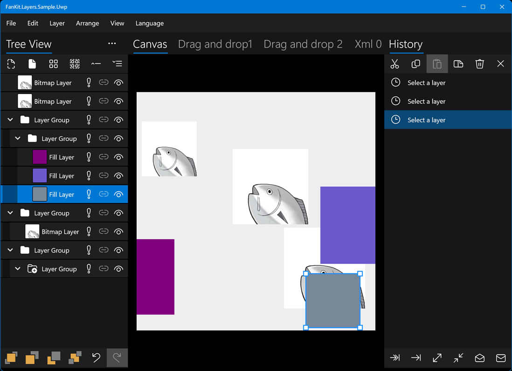
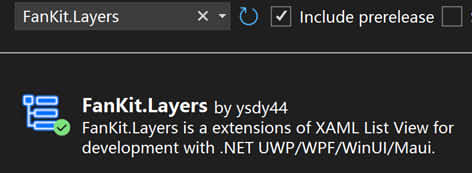

# FanKit.Layers

FanKit.Layers is a extensions of XAML List View for development with .NET UWP/WPF/WinUI/Maui.

Includes nodes/layer/history that are used for building Tree View/Layers Panel/History Panel targeting the 2D graphics rendering.

## Development environment

|Key|Value|
|:-|:-|
|System requirements| Windows 10 1803 or upper|
|Development tool|Visual Studio 2022|
|Programing language|C#|
|Display language|Deutsch/English/español/français/italiano/日本語/한국어/русский/中文(简体)|

## Sample application

|Framework|Progress|
|:-|:-|
|UWP|Completed|
|WPF|Completed|
|WinUI3|Completed|
|Maui|Completed|

## Nuget

1. Access [Nuget Gallery | FanKit.Layers](https://www.nuget.org/packages/FanKit.Layers)
2. Search **FanKit.Layers** in **Nuget Packages Manager** and download it.

## How to view the source code comments?

1. Find **...\FanKit.Layers\doc** folder
2. Overwrite the **docs.xml** file with the **en\docs.xml** file
3. Hover over the code, and a tool tip will be displayed
