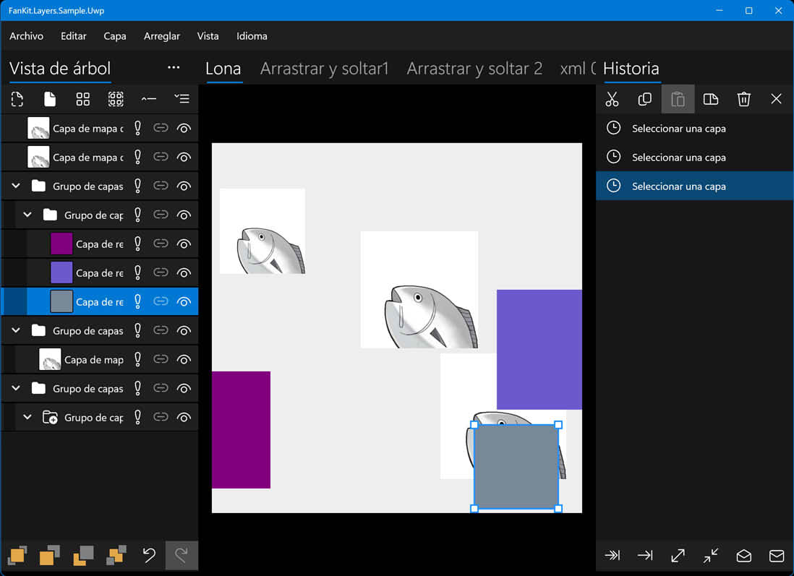

# FanKit.Layers

FanKit.Layers es una extensión de la vista de lista XAML para el desarrollo con .NET UWP/WPF/WinUI/Maui.

Incluye nodos/capas/historial que se utilizan para crear una vista de árbol/panel de capas/panel de historial destinado a la representación de gráficos 2D.

## Entorno de desarrollo

|Key|Value|
|:-|:-|
|Requisitos del sistema| Windows 10 1803 o superior|
|Herramienta de desarrollo|Visual Studio 2022|
|Lenguaje de programación|C#|
|Idioma de visualización|Deutsch/English/español/français/italiano/日本語/한국어/русский/中文(简体)|

## Ejemplo de aplicación

|Marco de referencia|Progreso|
|:-|:-|
|UWP|Completado|
|WPF|Completado|
|WinUI3|Completado|
|Maui|Completado|

## Nuget

En obra...

## ¿Cómo ver los comentarios del código fuente?

1. Buscar la carpeta **...\FanKit.Layers\doc**
2. Sobrescribir el archivo **docs.xml** con el archivo **es\docs.xml**
3. Coloque el cursor sobre el código y se mostrará una información sobre herramientas
