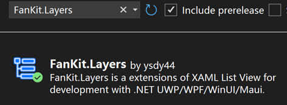

# FanKit.Layers

FanKit.Layers est une extension de l’affichage de liste XAML pour le développement avec .NET UWP/WPF/WinUI/Maui.

Comprend les nœuds/couches/historiques qui sont utilisés pour la construction de l’arborescence/du panneau des couches/du panneau d’historique ciblant le rendu graphique 2D.

## Environnement de développement

|Key|Value|
|:-|:-|
|Configuration requise| Windows 10 1803 ou supérieur|
|Outil de développement|Visual Studio 2022|
|Langage de programmation|C#|
|Langue d’affichage|Deutsch/English/español/français/italiano/日本語/한국어/русский/中文(简体)|

## Exemple d’application

|Cadre|Progrès|
|:-|:-|
|UWP|Terminé|
|WPF|Terminé|
|WinUI3|Terminé|
|Maui|Terminé|

## Nuget

1. Accès [Nuget Gallery | FanKit.Layers](https://www.nuget.org/packages/FanKit.Layers)
2. Recherchez **FanKit.Layers** dans **Nuget Packages Manager** et téléchargez-le.

## Comment afficher les commentaires du code source ?

1. Trouver le dossier **...\FanKit.Layers\doc**
2. Écraser le fichier **docs.xml** par le fichier **fr\docs.xml**
3. Passez la souris sur le code et une info-bulle s’affichera
