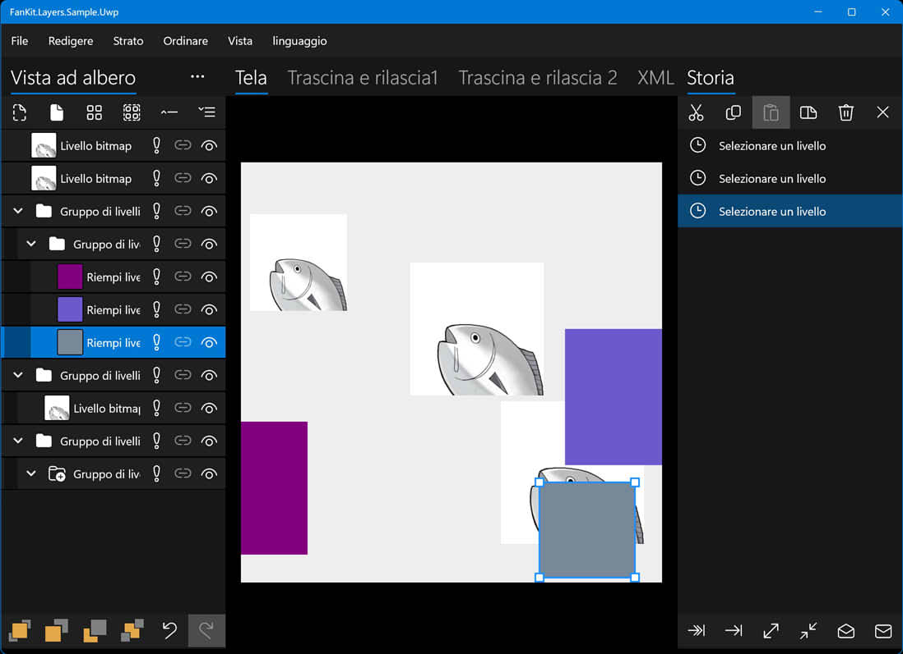

# FanKit.Layers

FanKit.Layers è un'estensione della visualizzazione elenco XAML per lo sviluppo con .NET UWP/WPF/WinUI/Maui.

Include nodi/livelli/cronologia utilizzati per la creazione di visualizzazione ad albero/pannello livelli/pannello cronologia destinati al rendering grafico 2D.

## Ambiente di sviluppo

|Key|Value|
|:-|:-|
|Requisiti di sistema| Windows 10 1803 o superiore|
|Strumento di sviluppo|Visual Studio 2022|
|Linguaggio di programmazione|C#|
|Lingua di visualizzazione|Deutsch/English/español/français/italiano/日本語/한국어/русский/中文(简体)|

## Esempio di applicazione

|Struttura|Progresso|
|:-|:-|
|UWP|Finito|
|WPF|In costruzione...|
|WinUI3|In costruzione...|
|Maui|In costruzione...|

## Nuget

In costruzione...

## Come visualizzare i commenti del codice sorgente?

1. Trova la cartella **...\FanKit.Layers\doc**
2. Sovrascrivere il file **docs.xml** con il file **it\docs.xml**
3. Passa il mouse sopra il codice e verrà visualizzata una descrizione comandi
