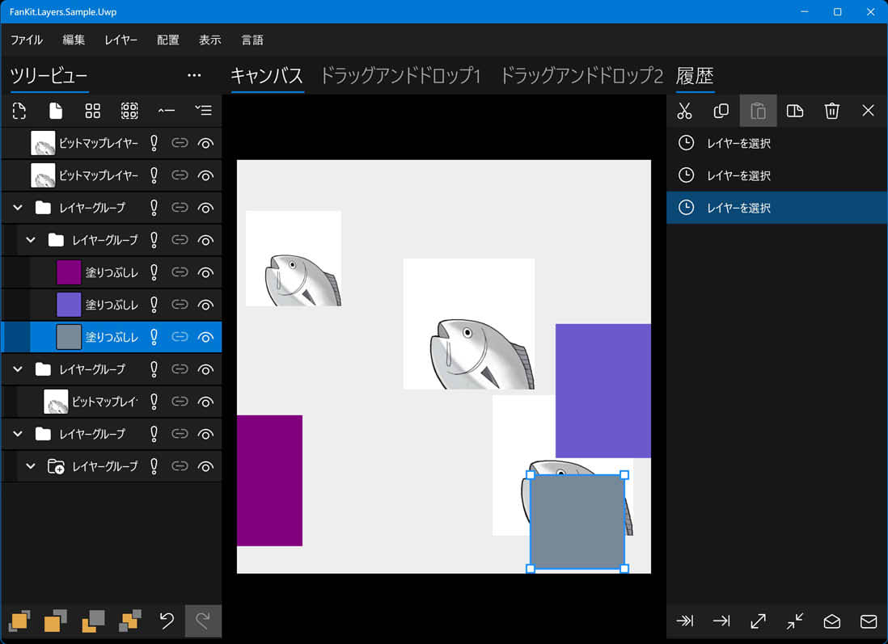

# FanKit.Layers

FanKit.Layers は、.NET UWP/WPF/WinUI/Maui を使用した開発用の XAML リスト ビューの拡張機能です。

2D グラフィックス レンダリングを対象とするツリー ビュー/レイヤー パネル/ヒストリー パネルの構築に使用されるノード/レイヤー/ヒストリが含まれます。

## 開発環境

|Key|Value|
|:-|:-|
|システム要件| Windows 10 1803 または上位|
|開発ツール|Visual Studio 2022|
|プログラム言語|C#|
|表示言語|Deutsch/English/español/français/italiano/日本語/한국어/русский/中文(简体)|

## サンプル・アプリケーション

|フレームワーク|経過|
|:-|:-|
|UWP|完了|
|WPF|完了|
|WinUI3|完了|
|Maui|完了|

## Nuget

1. アクセス[Nuget Gallery | FanKit.Layers](https://www.nuget.org/packages/FanKit.Layers)
2. **Nuget パッケージ マネージャー** で **FanKit.Layers** を検索し、ダウンロードします。

## ソースコードのコメントを表示する方法は?

1. **...\FanKit.Layers\doc**フォルダを検索
2. **docs.xml** ファイルを **jp\docs.xml** ファイルで上書きします
3. コードにカーソルを合わせると、ツールチップが表示されます
