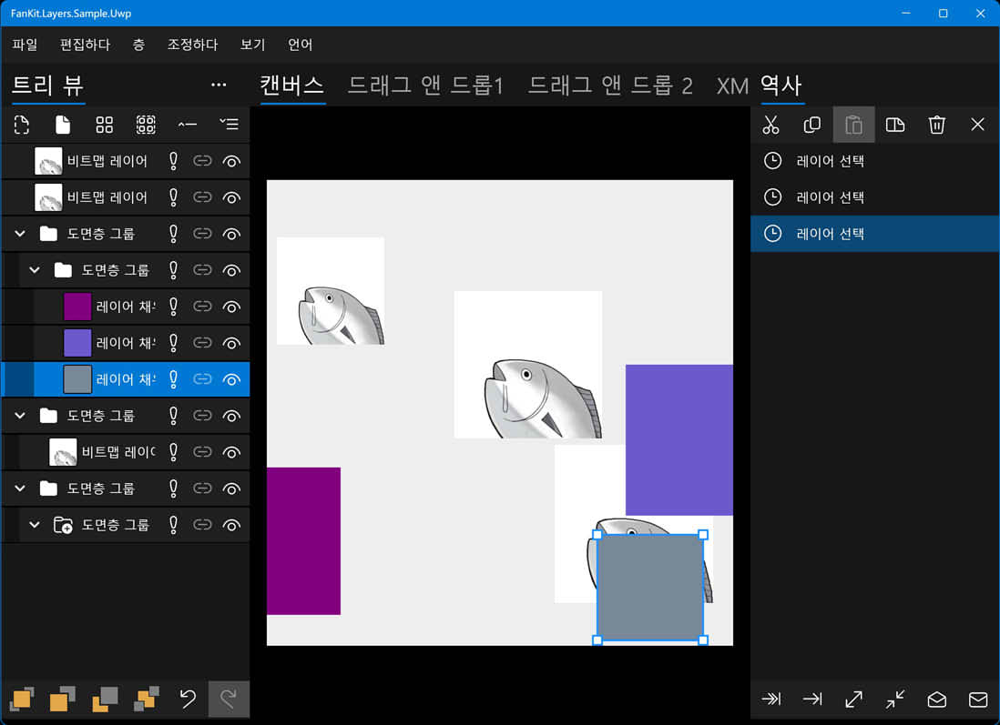

# FanKit.Layers

FanKit.Layers은 .NET UWP/WPF/WinUI/Maui를 사용한 개발을 위한 XAML 목록 보기의 확장입니다.

2D 그래픽 렌더링을 대상으로 하는 Tree View/Layers Panel/History Panel을 구축하는 데 사용되는 노드/레이어/히스토리를 포함합니다.

## 개발 환경

|Key|Value|
|:-|:-|
|시스템 요구 사항| Windows 10 1803 또는 어퍼|
|개발 도구|Visual Studio 2022|
|프로그래밍 언어|C#|
|표시 언어|Deutsch/English/español/français/italiano/日本語/한국어/русский/中文(简体)|

## 샘플 응용 프로그램

|틀|진보|
|:-|:-|
|UWP|완료|
|WPF|공사중...|
|WinUI3|공사중...|
|Maui|공사중...|

## Nuget

공사중...

## 소스 코드 주석을 보는 방법은 무엇입니까?

1. **...\FanKit.Layers\doc** 폴더 찾기
2. **docs.xml** 파일을 **ko\docs.xml** 파일로 덮어씁니다.
3. 코드 위로 마우스를 가져가면 도구 설명이 표시됩니다
