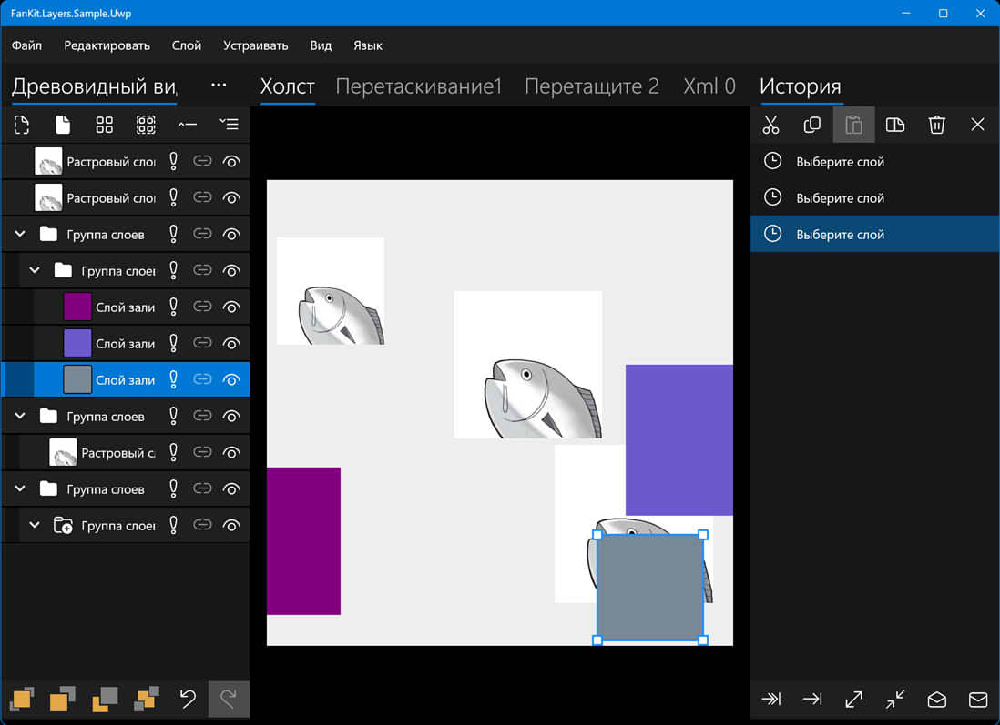

# FanKit.Layers

FanKit.Layers — это расширение XAML List View для разработки с .NET UWP/WPF/WinUI/Maui.

Включает в себя узлы/слои/историю, которые используются для построения Tree View/Layers Panel/History Panel, предназначенных для рендеринга 2D-графики.

## Среда разработки

|Key|Value|
|:-|:-|
|Требования к системе| Windows 10 1803 или верхний|
|Инструмент разработки|Visual Studio 2022|
|Язык программирования|C#|
|Язык отображения|Deutsch/English/español/français/italiano/日本語/한국어/русский/中文(简体)|

## Пример приложения

|Каркас|Прогресс|
|:-|:-|
|UWP|Завершённый|
|WPF|Завершённый|
|WinUI3|В процессе строительства...|
|Maui|В процессе строительства...|

## Nuget

В процессе строительства...

## Как посмотреть комментарии к исходному коду?

1. Найти папку **...\FanKit.Layers\doc**
2. Перезапись файла **docs.xml** файлом **ru\docs.xml**
3. Наведите курсор мыши на код, и отобразится всплывающая подсказка
