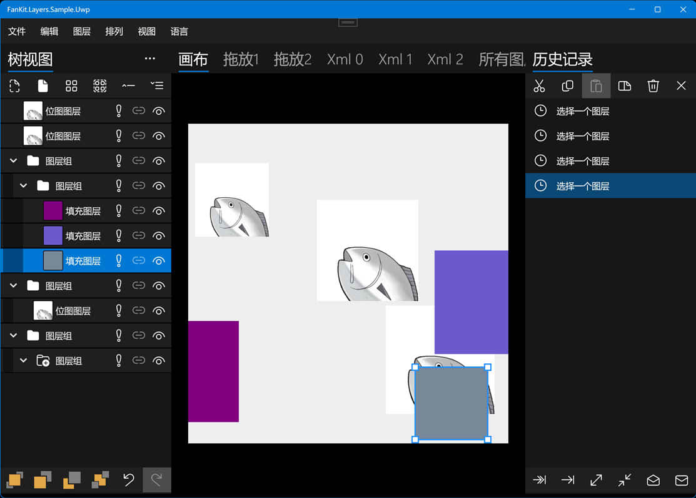

# FanKit.Layers

FanKit.Layers 是 XAML 列表视图的扩展，用于 .NET UWP/WPF/WinUI/Maui 开发。

包括节点/图层/历史，用于构建树视图/图层面板/历史面板，针对二维图形渲染。

## 开发环境

|Key|Value|
|:-|:-|
|系统要求| Windows 10 1803 或更高|
|开发工具|Visual Studio 2022|
|编程语言|C#|
|显示语言|Deutsch/English/español/français/italiano/日本語/한국어/русский/中文(简体)|

## 示例应用程序

|框架|进展|
|:-|:-|
|UWP|已完成|
|WPF|已完成|
|WinUI3|已完成|
|Maui|已完成|

## Nuget

正在施工...

## 如何查看源代码注释？

1. 找到 **...\FanKit.Layers\doc** 文件夹
2. 用 **zh-hans\docs.xml** 文件覆盖 **docs.xml** 文件
3. 将鼠标悬停在代码上，工具提示将显示
